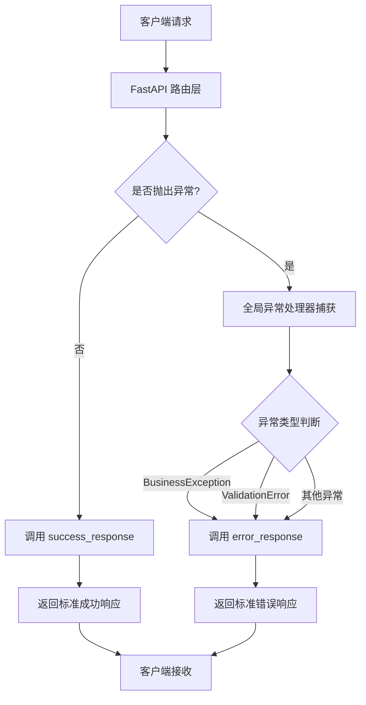
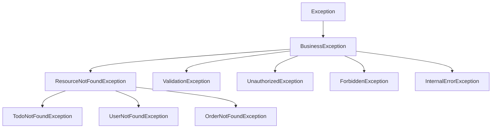
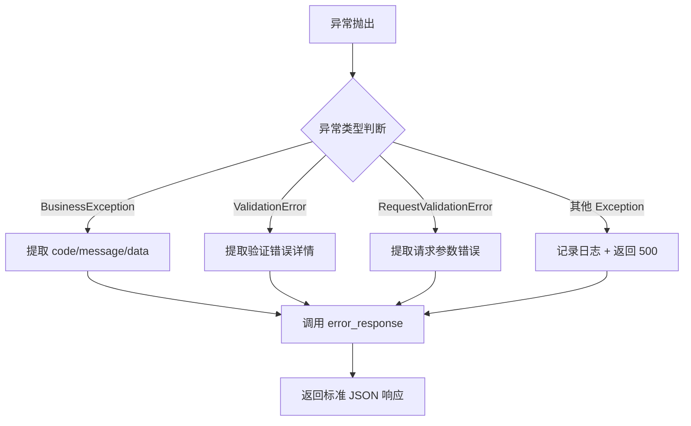

# FastAPI 统一响应模型与异常处理最佳实践

## 目录

- [一、为什么需要统一响应模型](#一为什么需要统一响应模型)
- [二、核心架构设计](#二核心架构设计)
- [三、业务状态码体系设计](#三业务状态码体系设计)
- [四、统一响应体模型实现](#四统一响应体模型实现)
- [五、异常类层次结构设计](#五异常类层次结构设计)
- [六、全局异常处理器实现](#六全局异常处理器实现)
- [七、路由层与服务层使用规范](#七路由层与服务层使用规范)
- [八、完整实战示例](#八完整实战示例)
- [九、常见问题与解决方案](#九常见问题与解决方案)
- [十、生产环境优化建议](#十生产环境优化建议)

---

## 一、为什么需要统一响应模型

### 1.1 痛点分析

在没有统一响应模型的项目中，通常会出现以下问题：

**问题 1：响应格式不一致**

```python
# 不同开发者返回格式五花八门
return {"code": 200, "msg": "success", "data": [...]}
return {"status": "ok", "result": [...]}
return {"success": True, "message": "操作成功", "items": [...]}
return "操作成功" + str(data)  # 甚至直接拼接字符串
```

**问题 2：前端解析困难**

- 每个接口都要单独处理响应结构
- 错误处理逻辑分散且重复
- 无法统一拦截和处理错误

**问题 3：维护成本高**

- 新增错误类型需要在多处修改
- 状态码含义不清晰，依赖口头约定
- 缺乏统一的错误码文档

### 1.2 统一响应的核心价值

✅ **标准化输出**：所有接口返回一致的 JSON 结构  
✅ **自动异常处理**：业务异常自动转换为标准错误响应  
✅ **前后端解耦**：前端只需一套解析逻辑  
✅ **易于扩展**：新增错误类型只需在枚举中定义  
✅ **文档友好**：Swagger 自动生成清晰的响应示例

---

## 二、核心架构设计

### 2.1 模块职责划分

```
core/
├── status_codes.py       # 业务状态码定义（枚举 + 消息映射）
├── responses.py          # 统一响应体模型 + 响应构建函数
├── exceptions.py         # 业务异常类层次结构
└── exception_handlers.py # 全局异常处理器（拦截并转换异常）
```

**职责说明：**

| 模块                      | 职责        | 关键内容                                                      |
|-------------------------|-----------|-----------------------------------------------------------|
| `status_codes.py`       | 定义业务状态码规范 | `BusinessCode` 枚举、消息映射表、HTTP 状态码转换                        |
| `responses.py`          | 提供标准化响应结构 | `ResponseBody` 模型、`success_response()`、`error_response()` |
| `exceptions.py`         | 定义业务异常类   | `BusinessException` 基类及各类子类异常                             |
| `exception_handlers.py` | 全局异常拦截与转换 | `global_exception_handler()` 统一处理所有异常                     |

### 2.2 数据流转图



---

## 三、业务状态码体系设计

### 3.1 状态码设计规范

**推荐规范：**

- **2xx**: 成功状态码（沿用 HTTP 标准）
- **4xxxx**: 客户端错误（5 位数，前两位表示 HTTP 状态码类别）
- **5xxxx**: 服务端错误（5 位数，前两位表示 HTTP 状态码类别）

**设计理由：**

1. 保留 HTTP 标准状态码语义（200、201、204）
2. 5 位数业务码避免与 HTTP 状态码冲突
3. 前两位对应 HTTP 状态码，便于理解和转换
4. 后三位用于细分具体错误场景

### 3.2 完整实现代码

```python
"""业务状态码模块

定义业务状态码枚举、消息映射表与 HTTP 状态码转换逻辑
"""

from enum import IntEnum


class BusinessCode(IntEnum):
    """业务状态码枚举
    
    状态码规范：
    - 2xx: 成功
    - 4xxxx: 客户端错误
    - 5xxxx: 服务端错误
    """
    # 成功状态码
    SUCCESS = 200
    CREATED = 201
    NO_CONTENT = 204

    # 客户端错误 (4xxxx)
    BAD_REQUEST = 40000
    VALIDATION_ERROR = 40001
    NOT_FOUND = 40400
    UNAUTHORIZED = 40100
    FORBIDDEN = 40300
    CONFLICT = 40900

    # 服务端错误 (5xxxx)
    INTERNAL_ERROR = 50000
    DATABASE_ERROR = 50001
    SERVICE_UNAVAILABLE = 50300


# 业务状态码消息映射表
BUSINESS_CODE_MESSAGES: dict[BusinessCode, str] = {
    BusinessCode.SUCCESS: '操作成功',
    BusinessCode.CREATED: '创建成功',
    BusinessCode.NO_CONTENT: '无内容',
    BusinessCode.BAD_REQUEST: '请求参数错误',
    BusinessCode.VALIDATION_ERROR: '参数验证失败',
    BusinessCode.NOT_FOUND: '资源不存在',
    BusinessCode.UNAUTHORIZED: '未授权访问',
    BusinessCode.FORBIDDEN: '禁止访问',
    BusinessCode.CONFLICT: '资源冲突',
    BusinessCode.INTERNAL_ERROR: '服务器内部错误',
    BusinessCode.DATABASE_ERROR: '数据库操作失败',
    BusinessCode.SERVICE_UNAVAILABLE: '服务暂时不可用',
}


def to_http_status(code: BusinessCode) -> int:
    """将业务状态码转换为 HTTP 状态码
    
    Args:
        code: 业务状态码
        
    Returns:
        int: 对应的 HTTP 状态码
    """
    if code < 300:
        return 200
    elif 40000 <= code < 41000:
        return 400
    elif 40100 <= code < 40200:
        return 401
    elif 40300 <= code < 40400:
        return 403
    elif 40400 <= code < 40500:
        return 404
    elif 40900 <= code < 41000:
        return 409
    else:
        return 500
```

### 3.3 扩展建议

根据实际业务需求，可以添加更多细分状态码：

```python
class BusinessCode(IntEnum):
    # ... 已有状态码 ...

    # 业务规则错误 (42xxx)
    INSUFFICIENT_BALANCE = 42001  # 余额不足
    INVENTORY_SHORTAGE = 42002  # 库存不足
    ORDER_STATUS_INVALID = 42003  # 订单状态无效

    # 第三方服务错误 (53xxx)
    PAYMENT_GATEWAY_ERROR = 53001  # 支付网关错误
    SMS_SERVICE_ERROR = 53002  # 短信服务错误
```

---

## 四、统一响应体模型实现

### 4.1 响应体结构设计

**标准响应格式：**

```json
{
  "code": 200,
  "message": "操作成功",
  "data": {
    // 实际业务数据
  }
}
```

**字段说明：**

- `code`: 业务状态码（整数），200 表示成功，其他表示各类错误
- `message`: 响应消息（字符串），描述操作结果或错误原因
- `data`: 响应数据载体（任意类型），成功时包含业务数据，失败时可为 null 或错误详情

### 4.2 完整实现代码

```python
"""统一响应模块

提供标准化的 HTTP 响应格式与响应体构建函数
"""

from typing import Generic, TypeVar, Any, Optional

from fastapi.responses import JSONResponse
from pydantic import BaseModel

from common.status_codes import BusinessCode, BUSINESS_CODE_MESSAGES, to_http_status

T = TypeVar('T')


class ResponseBody(BaseModel, Generic[T]):
    """标准化响应体模型
    
    Attributes:
        code: 业务状态码，200 表示成功，其他表示各类错误
        message: 响应消息，描述操作结果或错误原因
        data: 响应数据载体，支持任意类型，可选
    """
    code: int
    message: str
    data: Optional[T] = None

    class Config:
        from_attributes = True


def _get_http_status(code: BusinessCode) -> int:
    """将业务状态码转换为 HTTP 状态码（内部代理）"""
    return to_http_status(code)


def success_response(
        data: Any = None,
        message: str = '操作成功',
        code: BusinessCode = BusinessCode.SUCCESS
) -> JSONResponse:
    """构建成功响应
    
    Args:
        data: 响应数据，可选
        message: 成功消息，默认'操作成功'
        code: 业务状态码，默认 SUCCESS(200)
        
    Returns:
        JSONResponse: 标准化的 JSON 响应
    """
    response_body = ResponseBody(code=code, message=message, data=data)
    return JSONResponse(
        content=response_body.model_dump(mode='json'),
        status_code=200
    )


def error_response(
        code: BusinessCode,
        message: Optional[str] = None,
        data: Any = None
) -> JSONResponse:
    """构建错误响应
    
    Args:
        code: 业务状态码
        message: 错误消息，不传则使用默认消息
        data: 附加数据
        
    Returns:
        JSONResponse: 标准化的错误响应
    """
    from common.status_codes import BUSINESS_CODE_MESSAGES

    msg = message or BUSINESS_CODE_MESSAGES.get(code, '未知错误')
    response_body = ResponseBody(code=code, message=msg, data=data)
    http_status = to_http_status(code)
    return JSONResponse(
        content=response_body.model_dump(mode='json'),
        status_code=http_status
    )
```

### 4.3 关键技术点解析

#### 4.3.1 泛型支持（Generic[T]）

```python
class ResponseBody(BaseModel, Generic[T]):
    data: Optional[T] = None
```

**作用：**

- 允许 `data` 字段接受任意类型（列表、字典、对象等）
- Pydantic 会根据实际传入的类型进行校验和序列化
- 提高代码可读性和类型安全性

**使用示例：**

```python
# 返回列表数据
ResponseBody[list[Todo]](code=200, message="查询成功", data=[todo1, todo2])

# 返回单个对象
ResponseBody[Todo](code=200, message="查询成功", data=todo)

# 返回空数据
ResponseBody[None](code=200, message="删除成功", data=None)
```

#### 4.3.2 datetime 序列化问题

```python
response_body.model_dump(mode='json')
```

**为什么需要 `mode='json'`？**

Pydantic V2 中，`datetime` 对象默认序列化为 Python 对象而非 JSON 兼容格式。使用 `mode='json'` 确保：

- `datetime` 自动转换为 ISO 8601 字符串（如 `"2026-04-06T12:00:00"`）
- 所有数据类型都符合 JSON 规范
- 避免 `TypeError: Object of type datetime is not JSON serializable` 错误

**对比示例：**

```python
# ❌ 错误方式：可能抛出序列化异常
JSONResponse(content=response_body.dict())

# ✅ 正确方式：自动处理 datetime 等特殊类型
JSONResponse(content=response_body.model_dump(mode='json'))
```

#### 4.3.3 禁止字符串拼接字典

```python
# ❌ 绝对禁止的做法
return "操作成功" + str(data)

# ✅ 正确做法
return success_response(data=data, message="操作成功")
```

**原因：**

- 字符串拼接会破坏 JSON 结构，导致前端解析失败
- 违反 RESTful API 规范
- 无法利用 FastAPI 的自动文档生成功能

---

## 五、异常类层次结构设计

### 5.1 异常类设计原则

**核心原则：**

1. **继承关系清晰**：基类 → 通用异常 → 具体业务异常
2. **职责单一**：每个异常类只负责一类错误场景
3. **信息完整**：异常对象包含状态码、消息、附加数据
4. **易于扩展**：新增异常只需继承基类，无需修改现有代码

### 5.2 完整实现代码

```python
"""异常处理模块

定义业务异常类，提供统一的异常处理机制
"""

from typing import Any, Optional

from common.status_codes import BusinessCode, BUSINESS_CODE_MESSAGES


class BusinessException(Exception):
    """业务异常基类
    
    用于封装业务规则验证失败的场景，区别于基础格式验证
    
    Attributes:
        code: 业务状态码
        message: 错误消息
        data: 附加数据
    """

    def __init__(self, code: BusinessCode, message: Optional[str] = None, data: Any = None):
        self.code = code
        self.message = message or BUSINESS_CODE_MESSAGES.get(code, '未知错误')
        self.data = data
        super().__init__(self.message)


class ResourceNotFoundException(BusinessException):
    """资源不存在异常基类
    
    Attributes:
        resource_name: 资源名称
        identifier: 资源标识符
    """

    def __init__(self, resource_name: str, identifier: Optional[str] = None):
        message = f'{resource_name}不存在'
        if identifier:
            message = f'ID 为 {identifier} 的{resource_name}不存在'
        super().__init__(code=BusinessCode.NOT_FOUND, message=message)


class TodoNotFoundException(ResourceNotFoundException):
    """Todo 资源不存在异常"""

    def __init__(self, todo_id: Optional[str] = None):
        super().__init__(resource_name='Todo', identifier=todo_id)


class ValidationException(BusinessException):
    """参数验证异常
    
    用于封装业务层面的参数验证失败场景
    
    Attributes:
        message: 错误消息
        field: 验证失败的字段名
    """

    def __init__(self, message: str, field: Optional[str] = None):
        data = {'field': field} if field else None
        super().__init__(code=BusinessCode.VALIDATION_ERROR, message=message, data=data)


class UnauthorizedException(BusinessException):
    """未授权访问异常"""

    def __init__(self, message: str = '未授权访问'):
        super().__init__(code=BusinessCode.UNAUTHORIZED, message=message)


class ForbiddenException(BusinessException):
    """禁止访问异常"""

    def __init__(self, message: str = '禁止访问'):
        super().__init__(code=BusinessCode.FORBIDDEN, message=message)


class InternalErrorException(BusinessException):
    """服务器内部错误异常
    
    Attributes:
        message: 错误消息
        detail: 错误详情
    """

    def __init__(self, message: str = '服务器内部错误', detail: Optional[str] = None):
        data = {'detail': detail} if detail else None
        super().__init__(code=BusinessCode.INTERNAL_ERROR, message=message, data=data)
```

### 5.3 异常类层次结构图



### 5.4 自定义业务异常示例

根据实际业务需求，可以轻松扩展新的异常类：

```python
class InsufficientBalanceException(BusinessException):
    """余额不足异常"""

    def __init__(self, current_balance: float, required_amount: float):
        message = f'余额不足，当前余额: {current_balance}, 需要金额: {required_amount}'
        data = {
            'current_balance': current_balance,
            'required_amount': required_amount,
            'shortage': required_amount - current_balance
        }
        super().__init__(
            code=BusinessCode.INSUFFICIENT_BALANCE,
            message=message,
            data=data
        )


class InventoryShortageException(BusinessException):
    """库存不足异常"""

    def __init__(self, product_id: str, available_stock: int, requested_quantity: int):
        message = f'商品 {product_id} 库存不足，可用: {available_stock}, 需求: {requested_quantity}'
        data = {
            'product_id': product_id,
            'available_stock': available_stock,
            'requested_quantity': requested_quantity
        }
        super().__init__(
            code=BusinessCode.INVENTORY_SHORTAGE,
            message=message,
            data=data
        )
```

### 5.5 异常抛出规范

**在服务层抛出异常：**

```python
async def get_by_id(self, todo_id: str) -> Todo:
    todo = self.todos.get(todo_id)
    if not todo:
        raise TodoNotFoundException(todo_id=todo_id)  # ✅ 抛出专用异常
    return todo
```

**不要硬编码资源名称：**

```python
# ❌ 错误做法：硬编码资源名称，难以维护
raise BusinessException(
    code=BusinessCode.NOT_FOUND,
    message=f'Todo ID 为 {todo_id} 不存在'
)

# ✅ 正确做法：使用专用异常类
raise TodoNotFoundException(todo_id=todo_id)
```

**优势：**

- 异常类名即文档，代码可读性强
- 修改资源名称只需改一处（异常类定义）
- 全局异常处理器自动识别并返回标准响应

---

## 六、全局异常处理器实现

### 6.1 异常处理优先级

全局异常处理器按照以下优先级处理异常：

1. **业务异常** (`BusinessException`)：主动抛出的业务规则错误
2. **Pydantic 验证错误** (`ValidationError`)：数据模型校验失败
3. **FastAPI 请求验证错误** (`RequestValidationError`)：请求参数格式错误
4. **其他未捕获异常**：系统级错误或未知异常

### 6.2 完整实现代码

```python
"""全局异常处理模块

负责统一拦截和处理应用中的各类异常，返回标准化响应
"""

import traceback

from fastapi import Request
from fastapi.exceptions import RequestValidationError
from fastapi.responses import JSONResponse
from pydantic import ValidationError

from common.status_codes import BusinessCode
from common.exceptions import BusinessException
from common.response import error_response


async def global_exception_handler(request: Request, exc: Exception) -> JSONResponse:
   """全局异常处理器
   
   处理优先级：
   1. 业务异常 (BusinessException)
   2. Pydantic 验证错误 (ValidationError)
   3. FastAPI 请求验证错误 (RequestValidationError)
   4. 其他未捕获异常
   
   Args:
       request: FastAPI 请求对象
       exc: 异常实例
       
   Returns:
       JSONResponse: 标准化的错误响应
   """
   # 业务异常
   if isinstance(exc, BusinessException):
      return error_response(code=exc.code, message=exc.message, data=exc.data)

   # Pydantic 验证错误
   if isinstance(exc, ValidationError):
      return error_response(
         code=BusinessCode.VALIDATION_ERROR,
         message='数据验证失败',
         data={'errors': exc.errors()}
      )

   # FastAPI 请求验证错误
   if isinstance(exc, RequestValidationError):
      return error_response(
         code=BusinessCode.VALIDATION_ERROR,
         message='请求参数验证失败',
         data={'errors': exc.errors()}
      )

   # 其他未捕获的异常（生产环境应该记录日志）
   print(f"[ERROR] Unhandled exception: {type(exc).__name__}: {str(exc)}")
   print(traceback.format_exc())

   return error_response(
      code=BusinessCode.INTERNAL_ERROR,
      message='服务器内部错误',
      data={'detail': str(exc)} if str(exc) else None
   )
```

### 6.3 注册全局异常处理器

在 `main.py` 中注册异常处理器：

```python
"""FastAPI 应用主入口

应用启动与配置入口，负责初始化 FastAPI 实例、注册中间件与路由
"""

from fastapi import FastAPI

from common.exception_handlers import global_exception_handler
from router import books_router as todos_router
from service import shutdown_services


def create_app() -> FastAPI:
    """创建并配置 FastAPI 应用实例
    
    Returns:
        FastAPI: 配置完成的应用实例
    """
    application = FastAPI(
        title="Todo API",
        description="待办事项管理系统",
        version="0.1.0"
    )

    # 注册全局异常处理器
    application.add_exception_handler(Exception, global_exception_handler)

    # 注册路由
    application.include_router(todos_router)

    @application.on_event("shutdown")
    async def shutdown_application():
        """应用关闭事件处理器
        
        在应用停止时自动调用，用于释放资源
        """
        shutdown_services()

    return application


# 创建应用实例
app = create_app()

if __name__ == "__main__":
    import uvicorn

    uvicorn.run(app, host="0.0.0.0", port=8000)
```

**关键点：**

```python
# 注册 Exception 基类，捕获所有未处理的异常
application.add_exception_handler(Exception, global_exception_handler)
```

**为什么注册 `Exception` 而不是具体异常类？**

- `Exception` 是所有异常的基类，可以捕获所有异常
- 在处理器内部通过 `isinstance()` 判断具体类型，灵活分发
- 避免遗漏未预见的异常类型

### 6.4 异常处理流程图



---

## 七、路由层与服务层使用规范

### 7.1 分层职责划分

| 层级                | 职责                  | 异常处理方式                       |
|-------------------|---------------------|------------------------------|
| **路由层** (router)  | 接收请求、参数校验、调用服务、返回响应 | 不捕获异常，让全局处理器处理               |
| **服务层** (service) | 业务逻辑处理、数据操作         | 抛出业务异常（BusinessException 子类） |
| **全局处理器**         | 统一拦截异常、转换为标准响应      | 自动处理所有异常                     |

### 7.2 服务层：抛出业务异常

```python
"""Todo 业务服务模块"""

import asyncio
import uuid
from datetime import datetime

from common.exceptions import TodoNotFoundException
from models import TodoCreate, Todo, TodoUpdate


class TodoService:
    """Todo 业务服务类"""

    def __init__(self):
        self.todos: dict[str, Todo] = {}

    async def get_by_id(self, todo_id: str) -> Todo:
        """根据 ID 获取单个 Todo
        
        Raises:
            TodoNotFoundException: 当指定 ID 的 Todo 不存在时
        """
        await asyncio.sleep(0.05)
        todo = self.todos.get(todo_id)
        if not todo:
            raise TodoNotFoundException(todo_id=todo_id)  # ✅ 抛出专用异常
        return todo

    async def update(self, todo_id: str, todo_update: TodoUpdate) -> Todo:
        """更新现有 Todo
        
        Raises:
            TodoNotFoundException: 当指定 ID 的 Todo 不存在时
        """
        await asyncio.sleep(0.05)

        todo_origin = self.todos.get(todo_id)
        if not todo_origin:
            raise TodoNotFoundException(todo_id=todo_id)  # ✅ 抛出专用异常

        # 业务逻辑处理...
        updated_todo = Todo(...)
        self.todos[todo_id] = updated_todo
        return updated_todo
```

**关键原则：**

- ✅ 服务层只负责抛出异常，不负责构建响应
- ✅ 使用专用异常类（如 `TodoNotFoundException`），而非通用 `BusinessException`
- ✅ 异常信息要清晰明确，包含足够的上下文（如 ID、字段名等）

### 7.3 路由层：返回标准响应

```python
"""Todo 路由模块"""

from fastapi import APIRouter, Query, Path, Body

from common.status_codes import BusinessCode
from common.response import success_response
from models import TodoCreate, Todo, TodoUpdate
from service import todo_service

router = APIRouter()


@router.get('/todos/{id}', response_model=Todo)
async def get_todo(
        id: str = Path(..., min_length=1, description="Todo 唯一标识符")
):
   """获取单个 Todo 详情
   
   Raises:
       TodoNotFoundException: 当指定 ID 的 Todo 不存在时
   """
   todo = await todo_service.get_by_id(id)
   return success_response(data=todo, message='查询成功')  # ✅ 返回标准响应


@router.put('/todos/{id}', response_model=Todo)
async def update_todo(
        id: str = Path(..., min_length=1, description="待更新的 Todo ID"),
        todo_update: TodoUpdate = Body(
           None,
           example={
              "task": "修改后的任务描述",
              "priority": 4,
              "is_finished": True
           }
        )
):
   """更新 Todo 信息
   
   Raises:
       TodoNotFoundException: 当指定 ID 的 Todo 不存在时
   """
   updated_todo = await todo_service.update(id, todo_update)
   return success_response(data=updated_todo, message='修改成功')  # ✅ 返回标准响应


@router.post('/todos/', response_model=Todo, status_code=201)
async def create_todo(
        todo_create: TodoCreate = Body(
           ...,
           example={
              "task": "完成项目文档",
              "deadline": "2026-12-31T23:59:59",
              "assigned_to": "张三",
              "priority": 3
           }
        )
):
   """创建新的 Todo"""
   new_todo = await todo_service.create(todo_create)
   return success_response(
      data=new_todo,
      message='添加成功',
      code=BusinessCode.CREATED  # ✅ 使用 201 状态码
   )
```

**关键原则：**

- ✅ 路由层不捕获异常，让全局处理器自动处理
- ✅ 成功时使用 `success_response()` 构建响应
- ✅ 根据不同操作选择合适的状态码（200、201、204 等）
- ✅ 不要在路由层手动调用 `error_response()`，应通过抛出异常触发

### 7.4 常见错误用法对比

```python
# ❌ 错误做法 1：在路由层手动捕获异常并返回错误响应
@router.get('/todos/{id}')
async def get_todo(id: str):
    try:
        todo = await todo_service.get_by_id(id)
        return success_response(data=todo)
    except TodoNotFoundException as e:
        return error_response(code=e.code, message=e.message)  # 不要这样做


# ✅ 正确做法：让全局异常处理器自动处理
@router.get('/todos/{id}')
async def get_todo(id: str):
    todo = await todo_service.get_by_id(id)  # 可能抛出异常
    return success_response(data=todo)  # 成功时返回


# ❌ 错误做法 2：在服务层直接返回错误响应
class TodoService:
    async def get_by_id(self, todo_id: str):
        todo = self.todos.get(todo_id)
        if not todo:
            return error_response(code=40400, message="Todo 不存在")  # 不要这样做
        return todo


# ✅ 正确做法：服务层抛出异常
class TodoService:
    async def get_by_id(self, todo_id: str) -> Todo:
        todo = self.todos.get(todo_id)
        if not todo:
            raise TodoNotFoundException(todo_id=todo_id)  # 抛出异常
        return todo
```

---

## 八、完整实战示例

### 8.1 项目结构

```
project/
├── core/
│   ├── __init__.py
│   ├── status_codes.py       # 业务状态码
│   ├── responses.py          # 统一响应模型
│   ├── exceptions.py         # 业务异常类
│   └── exception_handlers.py # 全局异常处理器
├── models/
│   ├── __init__.py
│   └── todo.py              # Pydantic 数据模型
├── services/
│   ├── __init__.py
│   └── todos.py             # 业务服务层
├── router/
│   ├── __init__.py
│   └── todos.py             # 路由层
└── main.py                  # 应用入口
```

### 8.2 完整代码示例

#### 8.2.1 数据模型（models/todo.py）

```python
"""Todo 数据模型"""

from datetime import datetime
from typing import Optional
from pydantic import BaseModel, Field


class TodoBase(BaseModel):
    """Todo 基础模型"""
    task: str = Field(..., min_length=1, max_length=200, description="任务内容")
    deadline: Optional[datetime] = Field(None, description="截止时间")
    assigned_to: Optional[str] = Field(None, max_length=50, description="负责人")
    priority: int = Field(default=1, ge=1, le=5, description="优先级 1-5")


class TodoCreate(TodoBase):
    """创建 Todo 请求模型"""
    pass


class TodoUpdate(BaseModel):
    """更新 Todo 请求模型（所有字段可选）"""
    task: Optional[str] = Field(None, min_length=1, max_length=200)
    deadline: Optional[datetime] = None
    assigned_to: Optional[str] = Field(None, max_length=50)
    priority: Optional[int] = Field(None, ge=1, le=5)
    is_finished: Optional[bool] = None


class Todo(TodoBase):
    """Todo 响应模型"""
    id: str
    create_time: datetime
    is_finished: bool = False
    
    class Config:
        from_attributes = True
```

#### 8.2.2 业务服务（services/todos.py）

```python
"""Todo 业务服务模块"""

import asyncio
import uuid
from datetime import datetime

from common.exceptions import TodoNotFoundException
from models import TodoCreate, Todo, TodoUpdate


class TodoService:
    """Todo 业务服务类"""

    def __init__(self):
        self.todos: dict[str, Todo] = {}

    async def get_all(self, skip: int = 0, limit: int = 100) -> list[Todo]:
        """获取 Todo 列表（支持分页）"""
        await asyncio.sleep(0.05)
        all_todos = list(self.todos.values())
        return all_todos[skip: skip + limit]

    async def get_by_id(self, todo_id: str) -> Todo:
        """根据 ID 获取单个 Todo
        
        Raises:
            TodoNotFoundException: 当指定 ID 的 Todo 不存在时
        """
        await asyncio.sleep(0.05)
        todo = self.todos.get(todo_id)
        if not todo:
            raise TodoNotFoundException(todo_id=todo_id)
        return todo

    async def create(self, todo_create: TodoCreate) -> Todo:
        """创建新的 Todo"""
        await asyncio.sleep(0.05)

        todo_id = str(uuid.uuid4())
        todo_model = Todo(
            id=todo_id,
            task=todo_create.task,
            deadline=todo_create.deadline,
            assigned_to=todo_create.assigned_to,
            priority=todo_create.priority,
            create_time=datetime.now()
        )
        self.todos[todo_id] = todo_model
        return todo_model

    async def update(self, todo_id: str, todo_update: TodoUpdate) -> Todo:
        """更新现有 Todo
        
        Raises:
            TodoNotFoundException: 当指定 ID 的 Todo 不存在时
        """
        await asyncio.sleep(0.05)

        todo_origin = self.todos.get(todo_id)
        if not todo_origin:
            raise TodoNotFoundException(todo_id=todo_id)

        update_data = todo_update.model_dump(exclude_unset=True)

        updated_todo = Todo(
            id=todo_id,
            task=update_data.get('task', todo_origin.task),
            deadline=update_data.get('deadline', todo_origin.deadline),
            assigned_to=update_data.get('assigned_to', todo_origin.assigned_to),
            priority=update_data.get('priority', todo_origin.priority),
            create_time=todo_origin.create_time,
            is_finished=update_data.get('is_finished', todo_origin.is_finished)
        )
        self.todos[todo_id] = updated_todo
        return updated_todo

    async def delete(self, todo_id: str) -> Todo:
        """删除 Todo
        
        Raises:
            TodoNotFoundException: 当指定 ID 的 Todo 不存在时
        """
        await asyncio.sleep(0.05)

        todo = self.todos.pop(todo_id, None)
        if not todo:
            raise TodoNotFoundException(todo_id=todo_id)
        return todo


# 单例服务实例
todo_service = TodoService()
```

#### 8.2.3 路由层（router/todos.py）

```python
"""Todo 路由模块"""

from fastapi import APIRouter, Query, Path, Body

from common.status_codes import BusinessCode
from common.response import success_response
from models import TodoCreate, Todo, TodoUpdate
from service import todo_service

router = APIRouter()


@router.get('/todos/', response_model=list[Todo])
async def get_todos(
        skip: int = Query(default=0, ge=0, description="跳过记录数"),
        limit: int = Query(default=10, ge=1, le=100, description="返回记录上限")
):
   """获取 Todo 列表（支持分页查询）"""
   todos = await todo_service.get_all(skip=skip, limit=limit)
   return success_response(data=todos, message='查询成功')


@router.get('/todos/{id}', response_model=Todo)
async def get_todo(
        id: str = Path(..., min_length=1, description="Todo 唯一标识符")
):
   """获取单个 Todo 详情
   
   Raises:
       TodoNotFoundException: 当指定 ID 的 Todo 不存在时
   """
   todo = await todo_service.get_by_id(id)
   return success_response(data=todo, message='查询成功')


@router.post('/todos/', response_model=Todo, status_code=201)
async def create_todo(
        todo_create: TodoCreate = Body(
           ...,
           example={
              "task": "完成项目文档",
              "deadline": "2026-12-31T23:59:59",
              "assigned_to": "张三",
              "priority": 3
           }
        )
):
   """创建新的 Todo"""
   new_todo = await todo_service.create(todo_create)
   return success_response(data=new_todo, message='添加成功', code=BusinessCode.CREATED)


@router.put('/todos/{id}', response_model=Todo)
async def update_todo(
        id: str = Path(..., min_length=1, description="待更新的 Todo ID"),
        todo_update: TodoUpdate = Body(
           None,
           example={
              "task": "修改后的任务描述",
              "priority": 4,
              "is_finished": True
           }
        )
):
   """更新 Todo 信息（支持部分更新）
   
   Raises:
       TodoNotFoundException: 当指定 ID 的 Todo 不存在时
   """
   updated_todo = await todo_service.update(id, todo_update)
   return success_response(data=updated_todo, message='修改成功')


@router.delete('/todos/{id}', response_model=Todo)
async def delete_todo(
        id: str = Path(..., min_length=1, description="待删除的 Todo ID")
):
   """删除 Todo
   
   Raises:
       TodoNotFoundException: 当指定 ID 的 Todo 不存在时
   """
   deleted_todo = await todo_service.delete(id)
   return success_response(data=deleted_todo, message='删除成功')
```

#### 8.2.4 应用入口（main.py）

```python
"""FastAPI 应用主入口"""

from fastapi import FastAPI

from common.exception_handlers import global_exception_handler
from router import books_router as todos_router


def create_app() -> FastAPI:
    """创建并配置 FastAPI 应用实例"""
    application = FastAPI(
        title="Todo API",
        description="待办事项管理系统",
        version="0.1.0"
    )

    # 注册全局异常处理器
    application.add_exception_handler(Exception, global_exception_handler)

    # 注册路由
    application.include_router(todos_router)

    return application


# 创建应用实例
app = create_app()

if __name__ == "__main__":
    import uvicorn

    uvicorn.run(app, host="0.0.0.0", port=8000)
```

### 8.3 API 测试示例

#### 8.3.1 成功响应示例

**请求：**

```http
GET /todos/abc123
```

**响应（200 OK）：**

```json
{
  "code": 200,
  "message": "查询成功",
  "data": {
    "id": "abc123",
    "task": "完成项目文档",
    "deadline": "2026-12-31T23:59:59",
    "assigned_to": "张三",
    "priority": 3,
    "create_time": "2026-04-06T10:00:00",
    "is_finished": false
  }
}
```

#### 8.3.2 资源不存在响应

**请求：**

```http
GET /todos/nonexistent-id
```

**响应（404 Not Found）：**

```json
{
  "code": 40400,
  "message": "ID 为 nonexistent-id 的 Todo 不存在",
  "data": null
}
```

#### 8.3.3 参数验证失败响应

**请求：**

```http
POST /todos/
Content-Type: application/json

{
  "task": "",
  "priority": 10
}
```

**响应（400 Bad Request）：**

```json
{
  "code": 40001,
  "message": "请求参数验证失败",
  "data": {
    "errors": [
      {
        "loc": ["body", "task"],
        "msg": "String should have at least 1 character",
        "type": "string_too_short"
      },
      {
        "loc": ["body", "priority"],
        "msg": "Input should be less than or equal to 5",
        "type": "less_than_equal"
      }
    ]
  }
}
```

#### 8.3.4 创建成功响应

**请求：**

```http
POST /todos/
Content-Type: application/json

{
  "task": "完成项目文档",
  "deadline": "2026-12-31T23:59:59",
  "assigned_to": "张三",
  "priority": 3
}
```

**响应（201 Created）：**

```json
{
  "code": 201,
  "message": "添加成功",
  "data": {
    "id": "550e8400-e29b-41d4-a716-446655440000",
    "task": "完成项目文档",
    "deadline": "2026-12-31T23:59:59",
    "assigned_to": "张三",
    "priority": 3,
    "create_time": "2026-04-06T10:00:00",
    "is_finished": false
  }
}
```

---

## 九、常见问题与解决方案

### 9.1 问题 1：datetime 序列化失败

**错误信息：**

```
TypeError: Object of type datetime is not JSON serializable
```

**原因：**
Pydantic V2 中，`model_dump()` 默认返回 Python 对象，`datetime` 无法直接序列化为 JSON。

**解决方案：**

```python
# ✅ 使用 mode='json' 参数
JSONResponse(
    content=response_body.model_dump(mode='json'),
    status_code=200
)
```

### 9.2 问题 2：异常处理器未生效

**现象：**
抛出异常后，返回的是 FastAPI 默认的错误响应，而非标准响应格式。

**原因：**
忘记在 `main.py` 中注册全局异常处理器。

**解决方案：**

```python
# 在 create_app() 中添加
application.add_exception_handler(Exception, global_exception_handler)
```

### 9.3 问题 3：跨模块引用异常类失败

**错误信息：**

```
ImportError: cannot import name 'TodoNotFoundException' from 'core.exceptions'
```

**原因：**
修改了 `exceptions.py` 但未同步更新 `__init__.py` 导出。

**解决方案：**

```python
# common/__init__.py
from common.exceptions import (
    BusinessException,
    ResourceNotFoundException,
    TodoNotFoundException,
    ValidationException,
    UnauthorizedException,
    ForbiddenException,
    InternalErrorException,
)

__all__ = [
    'BusinessException',
    'ResourceNotFoundException',
    'TodoNotFoundException',
    'ValidationException',
    'UnauthorizedException',
    'ForbiddenException',
    'InternalErrorException',
]
```

### 9.4 问题 4：返回字符串拼接字典

**错误代码：**

```python
return "操作成功" + str(data)
```

**后果：**

- 前端收到的是字符串而非 JSON 对象
- 无法解析 `code`、`message`、`data` 字段
- Swagger 文档显示异常

**解决方案：**

```python
# ✅ 始终使用 success_response() 或 error_response()
return success_response(data=data, message="操作成功")
```

### 9.5 问题 5：Pydantic 验证器失败未抛出异常

**错误代码：**

```python
from pydantic import validator

class TodoCreate(BaseModel):
    task: str
    
    @validator('task')
    def validate_task(cls, v):
        if len(v) < 5:
            return v  # ❌ 验证失败但仍返回值
```

**后果：**
验证逻辑失效，非法数据进入业务层。

**解决方案：**

```python
from pydantic import field_validator
from common.exceptions import ValidationException


class TodoCreate(BaseModel):
    task: str

    @field_validator('task')
    @classmethod
    def validate_task(cls, v):
        if len(v) < 5:
            raise ValidationException(message="任务内容至少 5 个字符", field="task")  # ✅ 抛出异常
        return v
```

### 9.6 问题 6：Swagger 文档缺少请求体示例

**现象：**
Swagger UI 中请求体没有示例数据，前端开发者不清楚如何构造请求。

**解决方案：**

```python
@router.post('/todos/')
async def create_todo(
        todo_create: TodoCreate = Body(
            ...,
            example={  # ✅ 添加示例
                "task": "完成项目文档",
                "deadline": "2026-12-31T23:59:59",
                "assigned_to": "张三",
                "priority": 3
            }
        )
):
    ...
```

---

## 十、生产环境优化建议

### 10.1 日志记录

**当前实现：**

```python
# 简单打印到控制台
print(f"[ERROR] Unhandled exception: {type(exc).__name__}: {str(exc)}")
print(traceback.format_exc())
```

**生产环境优化：**

```python
import logging
import traceback

logger = logging.getLogger(__name__)


async def global_exception_handler(request: Request, exc: Exception) -> JSONResponse:
    # ... 其他异常处理 ...

    # 记录完整错误信息
    logger.error(
        f"Unhandled exception: {type(exc).__name__}: {str(exc)}\n"
        f"Request: {request.method} {request.url}\n"
        f"Traceback:\n{traceback.format_exc()}"
    )

    return error_response(
        code=BusinessCode.INTERNAL_ERROR,
        message='服务器内部错误',
        data=None  # 生产环境不要暴露详细错误信息
    )
```

**日志配置（main.py）：**

```python
import logging

logging.basicConfig(
    level=logging.INFO,
    format='%(asctime)s - %(name)s - %(levelname)s - %(message)s',
    handlers=[
        logging.FileHandler('app.log'),
        logging.StreamHandler()
    ]
)
```

### 10.2 敏感信息脱敏

**问题：**
生产环境不应向客户端暴露详细的错误堆栈或数据库信息。

**解决方案：**

```python
# 开发环境：返回详细错误信息
if settings.DEBUG:
    return error_response(
        code=BusinessCode.INTERNAL_ERROR,
        message='服务器内部错误',
        data={'detail': str(exc), 'traceback': traceback.format_exc()}
    )

# 生产环境：仅返回通用错误消息
else:
    logger.error(f"Internal error: {exc}")
    return error_response(
        code=BusinessCode.INTERNAL_ERROR,
        message='服务器内部错误',
        data=None
    )
```

### 10.3 性能监控

**添加请求耗时统计：**

```python
import time
from fastapi import Request

@app.middleware("http")
async def add_process_time_header(request: Request, call_next):
    start_time = time.time()
    response = await call_next(request)
    process_time = time.time() - start_time
    response.headers["X-Process-Time"] = str(process_time)
    return response
```

### 10.4 限流与防抖

**使用慢依赖注入实现限流：**

```python
from fastapi import Depends, HTTPException
from slowapi import Limiter
from slowapi.util import get_remote_address

limiter = Limiter(key_func=get_remote_address)


@router.get('/todos/')
@limiter.limit("10/minute")  # 每分钟最多 10 次请求
async def get_todos(request: Request):
    ...
```

### 10.5 数据库事务管理

**服务层添加事务支持：**

```python
from sqlalchemy.ext.asyncio import AsyncSession


class TodoService:
    def __init__(self, db: AsyncSession):
        self.db = db

    async def create(self, todo_create: TodoCreate) -> Todo:
        try:
            # 数据库操作
            todo_model = Todo(...)
            self.db.add(todo_model)
            await self.db.commit()
            return todo_model
        except Exception as e:
            await self.db.rollback()
            raise InternalErrorException(detail=str(e))
```

### 10.6 缓存策略

**添加 Redis 缓存：**

```python
import redis.asyncio as redis


class TodoService:
    def __init__(self, db: AsyncSession, cache: redis.Redis):
        self.db = db
        self.cache = cache

    async def get_by_id(self, todo_id: str) -> Todo:
        # 先查缓存
        cached = await self.cache.get(f"todo:{todo_id}")
        if cached:
            return Todo.parse_raw(cached)

        # 缓存未命中，查数据库
        todo = await self.db.query(Todo).filter(Todo.id == todo_id).first()
        if not todo:
            raise TodoNotFoundException(todo_id=todo_id)

        # 写入缓存（过期时间 5 分钟）
        await self.cache.setex(
            f"todo:{todo_id}",
            300,
            todo.json()
        )

        return todo
```

---

## 总结

### 核心要点回顾

1. **统一响应模型三要素**：
    - `status_codes.py`：定义业务状态码规范
    - `responses.py`：提供 `ResponseBody` 模型和响应构建函数
    - `exceptions.py`：定义业务异常类层次结构

2. **全局异常处理流程**：
    - 服务层抛出业务异常
    - 路由层不捕获异常，直接返回成功响应
    - 全局异常处理器自动拦截并转换为标准错误响应

3. **关键技术细节**：
    - 使用 `model_dump(mode='json')` 处理 datetime 序列化
    - 禁止字符串拼接字典作为响应
    - 异常类要专用化，避免硬编码资源名称
    - 修改代码后同步更新 `__init__.py` 导出

4. **生产环境优化**：
    - 添加完善的日志记录
    - 敏感信息脱敏
    - 性能监控与限流
    - 数据库事务管理
    - 缓存策略

### 适用场景

这套方案适用于：

- ✅ 新项目从零搭建
- ✅ 老项目重构统一响应格式
- ✅ 微服务架构中的服务间通信
- ✅ 前后端分离项目的 API 规范

### 扩展方向

- 集成 OpenTelemetry 实现分布式追踪
- 使用 GraphQL 替代 RESTful API
- 添加 WebSocket 实时通信的统一消息格式
- 实现 API 版本管理（v1、v2）

---

**文档版本：** v1.0  
**最后更新：** 2026-04-06  
**适用 FastAPI 版本：** 0.100+  
**适用 Pydantic 版本：** 2.x
